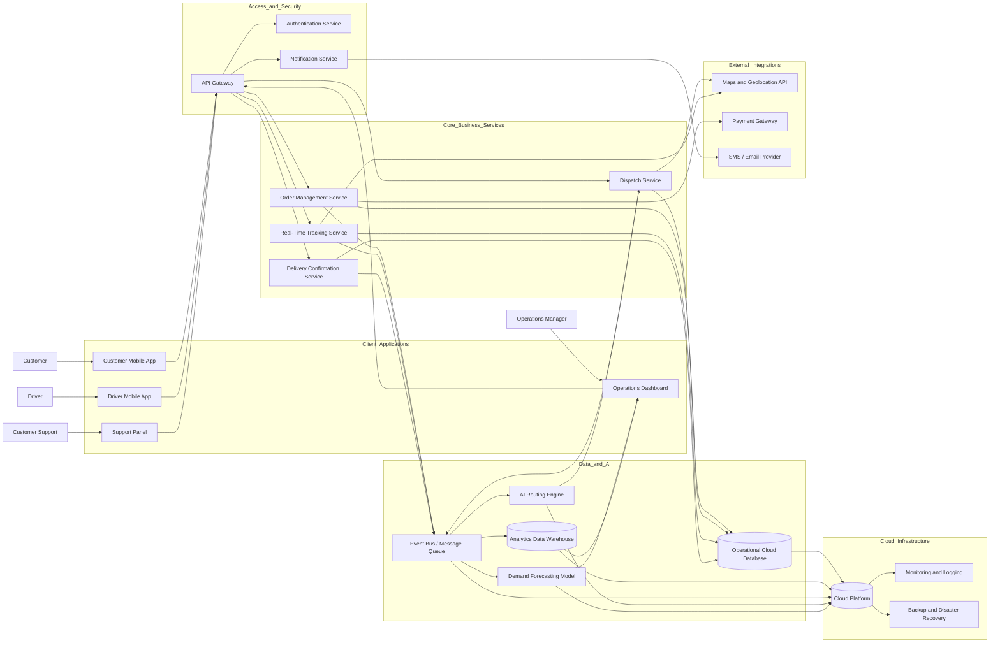

# Digital-Evolution_Transforming-Business
Repo para desarrollar el bloque II del proyecto 6.1 de Digitalización

# Fresh & Fast Logistics — Proyecto de Transformación Digital

## Introducción

Este proyecto presenta un **plan de transformación digital** para **Fresh & Fast Logistics**, una empresa de reparto de última milla que actualmente gestiona sus pedidos mediante llamadas telefónicas y procesos en papel.

El objetivo de la propuesta es rediseñar las operaciones de la empresa mediante una plataforma digital moderna, escalable y orientada a datos, capaz de mejorar la eficiencia, reducir errores manuales y facilitar el crecimiento futuro.

## Objetivo del proyecto

El propósito de este proyecto es diseñar una solución digital integrada que permita a Fresh & Fast Logistics:

- digitalizar la recepción y gestión de pedidos
- mejorar la eficiencia operativa
- reducir la dependencia de procesos manuales
- obtener visibilidad en tiempo real sobre las entregas
- construir una infraestructura escalable para el crecimiento futuro
- incorporar analítica de datos y optimización basada en IA

## Plataforma propuesta

La solución planteada es un sistema modular y cloud-based denominado: **FastRoute Digital Platform**

Esta plataforma conecta a clientes, repartidores, responsables de operaciones y personal de soporte a través de aplicaciones especializadas y servicios backend centralizados.

## System Architecture Diagram

## Visión general de la arquitectura

La arquitectura propuesta es una plataforma digital modular y basada en la nube, diseñada para gestionar pedidos en tiempo real, optimizar rutas, supervisar operaciones y mejorar la atención al cliente.

El sistema se divide en varias capas:
- Client Applications
- Access and Security
- Core Business Services
- Data and AI
- External Integrations
- Cloud Infrastructure

Esta separación mejora la escalabilidad, la seguridad, el mantenimiento y la capacidad de adaptación a largo plazo.

## Por qué esta arquitectura es adecuada

Esta arquitectura ha sido diseñada específicamente para una empresa de reparto de última milla. Es adecuada porque:

- permite operaciones en tiempo real
- reduce el trabajo manual y la coordinación por teléfono
- mejora la trazabilidad de las entregas
- facilita el acceso al sistema según el rol del usuario
- permite incorporar inteligencia artificial de forma realista
- ofrece visibilidad centralizada para responsables de operaciones
- puede escalar a medida que la empresa crezca

## Client Applications

La capa **Client Applications** es el punto de entrada de los usuarios a la **FastRoute Digital Platform**. Ofrece a cada perfil una interfaz adaptada a sus necesidades operativas, manteniendo al mismo tiempo la lógica de negocio centralizada en los servicios internos del sistema.

En lugar de utilizar una única aplicación para todos los usuarios, la plataforma se divide en cuatro aplicaciones cliente:
- Customer Mobile App
- Driver Mobile App
- Operations Dashboard
- Support Panel

Esta decisión mejora la usabilidad, la seguridad, el mantenimiento y la escalabilidad de la solución.

### 1. Customer Mobile App

La **Customer Mobile App** está diseñada para los clientes finales que desean realizar y consultar pedidos de forma rápida y sencilla.

#### Funciones principales

- registro e inicio de sesión
- creación de pedidos
- introducción de direcciones de recogida y entrega
- pago del servicio
- seguimiento del pedido en tiempo real
- recepción de notificaciones sobre el estado de la entrega
- consulta del historial de pedidos
- comunicación de incidencias

#### Por qué este componente es necesario

En el modelo actual de Fresh & Fast Logistics, los pedidos se gestionan por teléfono y papel, lo que provoca retrasos, errores de transcripción y poca trazabilidad. La **Customer Mobile App** digitaliza el primer contacto entre cliente y empresa, permitiendo que los datos entren directamente en el sistema en un formato estructurado.

#### Valor técnico

Esta aplicación reduce trabajo manual, estandariza la entrada de pedidos y genera datos en tiempo real que después pueden ser aprovechados por los sistemas de rutas, analítica y predicción de demanda.

#### Justificación arquitectónica

La **Customer Mobile App** funciona como el principal canal digital de captación de pedidos, reduciendo errores humanos y permitiendo la recogida estructurada de datos en tiempo real.

### 2. Driver Mobile App

La **Driver Mobile App** está diseñada para los repartidores y actúa como su herramienta operativa principal durante el trabajo en ruta.

#### Funciones principales

- inicio de sesión seguro
- recepción de rutas asignadas
- consulta de lista de entregas
- soporte de navegación GPS
- actualización del estado de los pedidos
- envío de prueba de entrega
- comunicación de incidencias o retrasos
- compartición de ubicación en tiempo real

#### Por qué este componente es necesario

En un modelo basado en llamadas telefónicas y anotaciones manuales, los repartidores reciben la información de manera poco eficiente y comunican los resultados con retraso. La **Driver Mobile App** permite trabajar con datos en vivo, actualizar el progreso de cada entrega al instante y mantener una conexión constante con el sistema central.

#### Valor técnico

Esta aplicación sostiene la operativa logística en tiempo real y alimenta la plataforma con eventos de ubicación y de estado de las entregas, fundamentales para el seguimiento, las notificaciones al cliente y el análisis de rendimiento.

#### Justificación arquitectónica

La **Driver Mobile App** digitaliza las operaciones de campo y permite la comunicación en tiempo real entre los repartidores y la plataforma central.

### 3. Operations Dashboard

El **Operations Dashboard** está pensado para responsables logísticos, supervisores y personal interno de operaciones.

#### Funciones principales

- monitorización en directo de los pedidos
- visualización del estado de los repartidores
- supervisión de rutas activas
- consulta de métricas de rendimiento
- detección de retrasos e incidencias
- reasignación manual de pedidos
- visión general de la carga de trabajo
- acceso a datos analíticos y previsiones

#### Por qué este componente es necesario

Una empresa de reparto necesita visibilidad centralizada sobre lo que está ocurriendo en cada momento. Sin un panel de control, los responsables dependen de llamadas, hojas de cálculo o notas en papel, lo que vuelve la toma de decisiones lenta y reactiva.

El **Operations Dashboard** crea un centro de control desde el que la empresa puede supervisar la actividad diaria y reaccionar con rapidez ante cualquier problema.

##@# Valor técnico

Este componente transforma la gestión operativa, pasando de una supervisión manual a una toma de decisiones basada en datos.

#### Justificación arquitectónica

El **Operations Dashboard** proporciona visibilidad operativa en tiempo real y facilita decisiones de gestión más rápidas y fundamentadas.

### 4. Support Panel

El **Support Panel** está diseñado para el personal de atención al cliente que gestiona incidencias, reclamaciones, cambios en pedidos y asistencia general.

#### Funciones principales

- búsqueda de clientes
- consulta y revisión de pedidos
- gestión de incidencias de entrega
- actualización manual de pedidos
- soporte en la comunicación con el cliente
- gestión de solicitudes de reembolso o escalado
- acceso al historial de interacciones

#### Por qué este componente es necesario

El equipo de atención al cliente no debería depender de registros en papel ni de preguntar a otros departamentos para obtener información. Necesita una interfaz propia con acceso rápido a los datos del cliente y del pedido.

Esto mejora los tiempos de respuesta y la calidad del servicio.

#### Valor técnico

El **Support Panel** centraliza los procesos de asistencia al cliente y garantiza que el personal de soporte trabaje con los mismos datos en tiempo real que utiliza el equipo de operaciones.

#### Justificación arquitectónica

El **Support Panel** mejora la eficiencia del servicio al proporcionar al personal de soporte acceso controlado a información actualizada de clientes y pedidos.

## Justificación de la separación de las Client Applications

La decisión de separar la capa cliente en varias aplicaciones especializadas es una de las elecciones arquitectónicas más importantes del sistema.

### Diseño por roles

Cada tipo de usuario tiene objetivos distintos:

- el cliente busca sencillez
- el repartidor necesita rapidez operativa
- el responsable de operaciones requiere visibilidad global
- el personal de soporte necesita herramientas para resolver problemas

Una única interfaz para todos sería menos eficiente y más confusa.

### Mayor seguridad

Cada aplicación puede mostrar únicamente las funciones permitidas para ese perfil. Esto facilita la aplicación de control de acceso por roles y reduce el acceso innecesario a información sensible.

### Mantenimiento más sencillo

Si en el futuro la empresa necesita mejorar la **Driver Mobile App**, podrá hacerlo sin rediseñar la experiencia del cliente o los paneles internos.

### Escalabilidad

Cada una de las **Client Applications** puede evolucionar de forma independiente según crezcan las necesidades del negocio.

### Mejor experiencia de usuario

Una interfaz especializada mejora la productividad, reduce errores de uso y disminuye la necesidad de formación compleja.

### Justificación global

La separación de la capa **Client Applications** en herramientas especializadas mejora la experiencia de usuario, refuerza la seguridad y permite que la plataforma evolucione de forma modular y escalable.

## Tecnologías recomendadas

### Customer Mobile App

- **Frontend:** Flutter o React Native
- **Motivo:** permiten desarrollo multiplataforma para iOS y Android

### Driver Mobile App

- **Frontend:** Flutter o React Native
- **Motivo:** son adecuados para un entorno móvil que necesita GPS, cámara y notificaciones

### Operations Dashboard

- **Frontend:** React o Angular
- **Motivo:** permiten crear interfaces web dinámicas con monitorización en tiempo real y paneles analíticos

### Support Panel

- **Frontend:** React
- **Motivo:** resulta muy adecuado para una herramienta web interna rápida y eficiente

### Justificación tecnológica

El desarrollo móvil multiplataforma reduce costes de implementación y mantenimiento, mientras que las interfaces web ofrecen flexibilidad y facilidad de acceso para el personal interno.

## Riesgos y consideraciones de diseño

### Problemas de conectividad

Los repartidores pueden operar en zonas con cobertura móvil deficiente.

**Solución:**  
La **Driver Mobile App** debería incorporar almacenamiento temporal local y sincronización diferida cuando se recupere la conexión.

### Privacidad de los datos

Los datos de clientes, direcciones y entregas deben protegerse adecuadamente.

**Solución:**  
Todas las **Client Applications** deben usar comunicaciones cifradas mediante HTTPS y mecanismos de autenticación seguros.

### Facilidad de adopción

Parte del personal puede no estar acostumbrado a herramientas digitales.

**Solución:**  
Las interfaces deben ser intuitivas y estar acompañadas de formación específica para los empleados.
